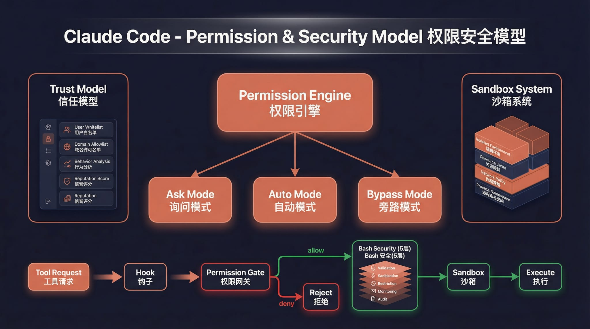

# Claude Code Haha

基于 Claude Code 泄露源码修复的**本地可运行版本**，支持接入任意 Anthropic 兼容 API（如 MiniMax、OpenRouter 等）。

> 原始泄露源码无法直接运行。本仓库修复了启动链路中的多个阻塞问题，使完整的 Ink TUI 交互界面可以在本地工作。

<p align="center">
  
</p>

## 功能

- 完整的 Ink TUI 交互界面（与官方 Claude Code 一致）
- `--print` 无头模式（脚本/CI 场景）
- 支持 MCP 服务器、插件、Skills
- 支持自定义 API 端点和模型
- 降级 Recovery CLI 模式

---

## 架构概览

<table>
  <tr>
    <td align="center" width="25%"><br><b>整体架构</b></td>
    <td align="center" width="25%"><br><b>请求生命周期</b></td>
    <td align="center" width="25%"><br><b>工具系统</b></td>
    <td align="center" width="25%"><br><b>多 Agent 架构</b></td>
  </tr>
  <tr>
    <td align="center" width="25%"><br><b>终端 UI</b></td>
    <td align="center" width="25%"><br><b>权限与安全</b></td>
    <td align="center" width="25%"><br><b>服务层</b></td>
    <td align="center" width="25%"><br><b>状态与数据流</b></td>
  </tr>
</table>

---

## 快速开始

### 1. 安装依赖

需要 [Bun](https://bun.sh) >= 1.1 和 Node.js >= 18。

```bash
npm install
```

### 2. 配置环境变量

复制示例文件并填入你的 API Key。下面示例默认使用月之暗面 Kimi：

```bash
cp .env.example .env
```

编辑 `.env`：

```env
# Kimi / Moonshot（国区官方 Claude Code 推荐写法）
ANTHROPIC_AUTH_TOKEN=sk-xxx       # Kimi 开放平台 API Key，走 Authorization: Bearer
# ANTHROPIC_API_KEY=sk-xxx        # 可选：仅当你的代理服务要求 x-api-key 时使用

# Anthropic 兼容端点（国区）
ANTHROPIC_BASE_URL=https://api.moonshot.cn/anthropic
# 国际站可改为：
# ANTHROPIC_BASE_URL=https://api.moonshot.ai/anthropic

# 模型配置
ANTHROPIC_MODEL=kimi-k2.5
ANTHROPIC_DEFAULT_SONNET_MODEL=kimi-k2.5
ANTHROPIC_DEFAULT_HAIKU_MODEL=kimi-k2.5
ANTHROPIC_DEFAULT_OPUS_MODEL=kimi-k2.5
CLAUDE_CODE_SUBAGENT_MODEL=kimi-k2.5

# Kimi 官方文档建议在 Claude Code 下关闭 tool search
ENABLE_TOOL_SEARCH=false

# 超时（毫秒）
API_TIMEOUT_MS=3000000

# 禁用遥测和非必要网络请求
DISABLE_TELEMETRY=1
CLAUDE_CODE_DISABLE_NONESSENTIAL_TRAFFIC=1
```

### 3. 启动

```bash
# 交互 TUI 模式（完整界面）
./bin/claude-haha

# 无头模式（单次问答）
./bin/claude-haha -p "your prompt here"

# 管道输入
echo "explain this code" | ./bin/claude-haha -p

# 查看所有选项
./bin/claude-haha --help
```

---

## 环境变量说明

| 变量 | 必填 | 说明 |
|------|------|------|
| `ANTHROPIC_API_KEY` | 二选一 | API Key，通过 `x-api-key` 头发送 |
| `ANTHROPIC_AUTH_TOKEN` | 二选一 | Auth Token，通过 `Authorization: Bearer` 头发送 |
| `ANTHROPIC_BASE_URL` | 否 | 自定义 API 端点，默认 Anthropic 官方 |
| `ANTHROPIC_MODEL` | 否 | 默认模型 |
| `ANTHROPIC_DEFAULT_SONNET_MODEL` | 否 | Sonnet 级别模型映射 |
| `ANTHROPIC_DEFAULT_HAIKU_MODEL` | 否 | Haiku 级别模型映射 |
| `ANTHROPIC_DEFAULT_OPUS_MODEL` | 否 | Opus 级别模型映射 |
| `CLAUDE_CODE_SUBAGENT_MODEL` | 否 | 子 Agent 使用的模型，建议和主模型保持一致 |
| `ENABLE_TOOL_SEARCH` | 否 | 对 Kimi 建议设为 `false`，避免 tool search 兼容性问题 |
| `API_TIMEOUT_MS` | 否 | API 请求超时，默认 600000 (10min) |
| `DISABLE_TELEMETRY` | 否 | 设为 `1` 禁用遥测 |
| `CLAUDE_CODE_DISABLE_NONESSENTIAL_TRAFFIC` | 否 | 设为 `1` 禁用非必要网络请求 |

---

## 降级模式

如果完整 TUI 出现问题，可以使用简化版 readline 交互模式：

```bash
CLAUDE_CODE_FORCE_RECOVERY_CLI=1 ./bin/claude-haha
```

---

## 相对于原始泄露源码的修复

泄露的源码无法直接运行，主要修复了以下问题：

| 问题 | 根因 | 修复 |
|------|------|------|
| TUI 不启动 | 入口脚本把无参数启动路由到了 recovery CLI | 恢复走 `cli.tsx` 完整入口 |
| 启动卡死 | `verify` skill 导入缺失的 `.md` 文件，Bun text loader 无限挂起 | 创建 stub `.md` 文件 |
| `--print` 卡死 | `filePersistence/types.ts` 缺失 | 创建类型桩文件 |
| `--print` 卡死 | `ultraplan/prompt.txt` 缺失 | 创建资源桩文件 |
| **Enter 键无响应** | `modifiers-napi` native 包缺失，`isModifierPressed()` 抛异常导致 `handleEnter` 中断，`onSubmit` 永远不执行 | 加 try-catch 容错 |
| setup 被跳过 | `preload.ts` 自动设置 `LOCAL_RECOVERY=1` 跳过全部初始化 | 移除默认设置 |

---

## 项目结构

```
bin/claude-haha          # 入口脚本
preload.ts               # Bun preload（设置 MACRO 全局变量）
.env.example             # 环境变量模板
src/
├── entrypoints/cli.tsx  # CLI 主入口
├── main.tsx             # TUI 主逻辑（Commander.js + React/Ink）
├── localRecoveryCli.ts  # 降级 Recovery CLI
├── setup.ts             # 启动初始化
├── screens/REPL.tsx     # 交互 REPL 界面
├── ink/                 # Ink 终端渲染引擎
├── components/          # UI 组件
├── tools/               # Agent 工具（Bash, Edit, Grep 等）
├── commands/            # 斜杠命令（/commit, /review 等）
├── skills/              # Skill 系统
├── services/            # 服务层（API, MCP, OAuth 等）
├── hooks/               # React hooks
└── utils/               # 工具函数
```

---

## 技术栈

| 类别 | 技术 |
|------|------|
| 运行时 | [Bun](https://bun.sh) |
| 语言 | TypeScript |
| 终端 UI | React + [Ink](https://github.com/vadimdemedes/ink) |
| CLI 解析 | Commander.js |
| API | Anthropic SDK |
| 协议 | MCP, LSP |

---

## Disclaimer

本仓库基于 2026-03-31 从 Anthropic npm registry 泄露的 Claude Code 源码。所有原始源码版权归 [Anthropic](https://www.anthropic.com) 所有。仅供学习和研究用途。
