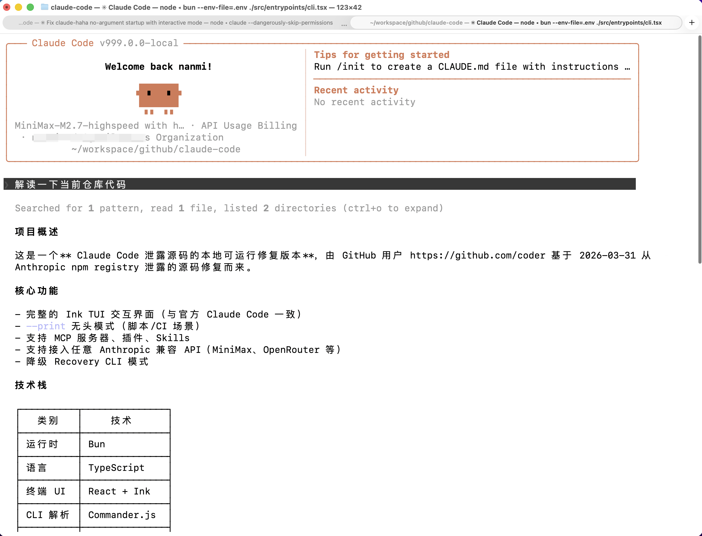

# Claude Code Haha

基于 Claude Code 泄露源码修复的本地可运行版本，支持接入任意 Anthropic 兼容接口。

> 当前文档默认以 Kimi 国区为示例，同时补充 Kimi 国际站和通用 Anthropic 兼容接口配置。

<p align="center">
  
</p>

## 功能

- 完整的 Ink TUI 交互界面
- `--print` 无头模式
- 支持 MCP 服务器、插件、Skills
- 支持自定义模型与 Anthropic 兼容接口
- 提供 Recovery CLI 降级模式

## 快速开始

### 1. 安装依赖

需要 Node.js >= 18，推荐安装 Bun 1.3+。

```bash
npm install
```

### 2. 配置环境变量

复制模板：

```bash
cp .env.example .env
```

在 `.env` 中至少填好：

```env
ANTHROPIC_AUTH_TOKEN=sk-xxx
ANTHROPIC_BASE_URL=https://api.moonshot.cn/anthropic
ANTHROPIC_MODEL=kimi-k2.5
ANTHROPIC_DEFAULT_OPUS_MODEL=kimi-k2.5
ANTHROPIC_DEFAULT_SONNET_MODEL=kimi-k2.5
ANTHROPIC_DEFAULT_HAIKU_MODEL=kimi-k2.5
CLAUDE_CODE_SUBAGENT_MODEL=kimi-k2.5
ENABLE_TOOL_SEARCH=false
```

更多供应商模板见 [provider-config.md](docs/provider-config.md)。

### 3. 启动

推荐统一使用 `package.json` scripts：

```bash
bun run start
```

常用命令：

```bash
# 交互模式
bun run start

# 单次问答
bun run start -- -p "your prompt here"

# Recovery CLI
bun run start:recovery
```

三平台详细运行说明见 [local-run.md](docs/local-run.md)。

## 文档导航

- [本地运行指南](docs/local-run.md)
- [模型接口配置指南](docs/provider-config.md)

## 关键环境变量

| 变量 | 说明 |
|------|------|
| `ANTHROPIC_BASE_URL` | Anthropic 兼容接口地址 |
| `ANTHROPIC_AUTH_TOKEN` | Bearer Token 鉴权 |
| `ANTHROPIC_API_KEY` | `x-api-key` 鉴权 |
| `ANTHROPIC_MODEL` | 默认主模型 |
| `ANTHROPIC_DEFAULT_OPUS_MODEL` | Opus 级别映射 |
| `ANTHROPIC_DEFAULT_SONNET_MODEL` | Sonnet 级别映射 |
| `ANTHROPIC_DEFAULT_HAIKU_MODEL` | Haiku 级别映射 |
| `CLAUDE_CODE_SUBAGENT_MODEL` | 子 Agent 模型 |
| `ENABLE_TOOL_SEARCH` | Tool Search 行为控制 |
| `ANTHROPIC_CUSTOM_HEADERS` | 自定义请求头，多行 `Header: Value` 格式 |

## 说明

- `.env` 已被 Git 忽略，不会提交到仓库。
- `.env.example` 只保留占位符，不应填写真实密钥。
- 本项目文档覆盖的是 Anthropic 兼容接口；纯 OpenAI 原生接口不作为直接主路径说明。

## Disclaimer

本仓库基于 2026-03-31 从 Anthropic npm registry 泄露的 Claude Code 源码。所有原始源码版权归 Anthropic 所有，仅供学习和研究用途。
